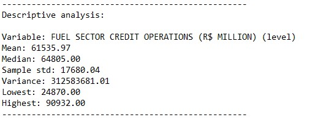

# **DESCRIPTION**
The petroleum industry, also known as the oil industry or the oil patch, includes the global processes of exploration, extraction, refining, transporting (often by oil tankers and pipelines), and marketing of petroleum products. The largest volume products of the industry are fuel oil and gasoline (petrol). Petroleum is also the raw material for many chemical products, including pharmaceuticals, solvents, fertilizers, pesticides, synthetic fragrances, and plastics. The industry is usually divided into three major components: upstream, midstream, and downstream. Upstream regards exploration and extraction of crude oil, midstream encompasses transportation and storage of crude, and downstream concerns refining crude oil into various end products.

Source: https://opendata.bcb.gov.br/dataset/27747-credit-operations-outstanding-by-economic-activity---petroleum-gas-and-alcohol-fuel-sector

# **RESULTS**
Results obtained through the model estimation process.

## Variable analysis at level:
    

    

    

    

## Study of data stationarity:
    

    

## SEASONAL ADJUSTMENT:
    

    

## Model results:
    

## Residual analysis:
    

    

    

# FORECAST:
    
